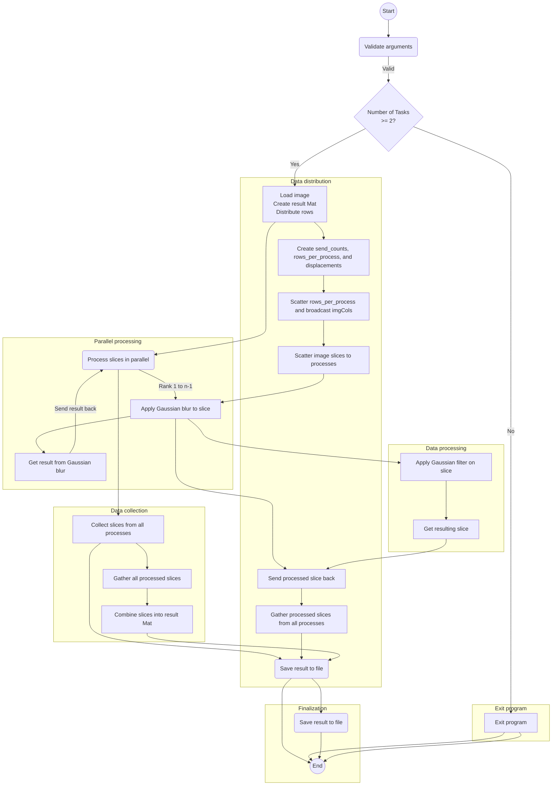

## Flowchart for Gaussian Blur Image Processing with MPI

```mermaid
graph TD
    A((Start)) --> B(Validate arguments)
    B --> |Valid| C{Number of Tasks <br/> >= 2?}
    C --> |Yes| D[Load image <br/> Create result Mat <br/> Distribute rows]
    C --> |No| E[Exit program]
    D --> F(Process slices in parallel)
    F --> G[Collect slices from all processes]
    G --> H(Save result to file)
    H --> I((End))
    E --> I((End))
    subgraph Parallel processing
    F
    F -->|Rank 1 to n-1| J[Apply Gaussian blur to slice]
    J --> K[Get result from Gaussian blur]
    K --> |Send result back| F
end
	subgraph Data distribution
    D
    D --> L[Create send_counts, rows_per_process, and displacements]
    L --> M[Scatter rows_per_process and broadcast imgCols]
    M --> N[Scatter image slices to processes]
    N --> J
    J --> O[Send processed slice back]
    O --> P[Gather processed slices from all processes]
    P --> H
end
	subgraph Data processing
    J
    J --> Q[Apply Gaussian filter on slice]
    Q --> R[Get resulting slice]
    R --> O
end
	 subgraph Data collection
    G
    G --> S[Gather all processed slices]
    S --> T[Combine slices into result Mat]
    T --> H
end
	subgraph Finalization
    H
    H --> U(Save result to file)
    U --> I
end
	subgraph Exit program
    E
    E --> I
end


```
